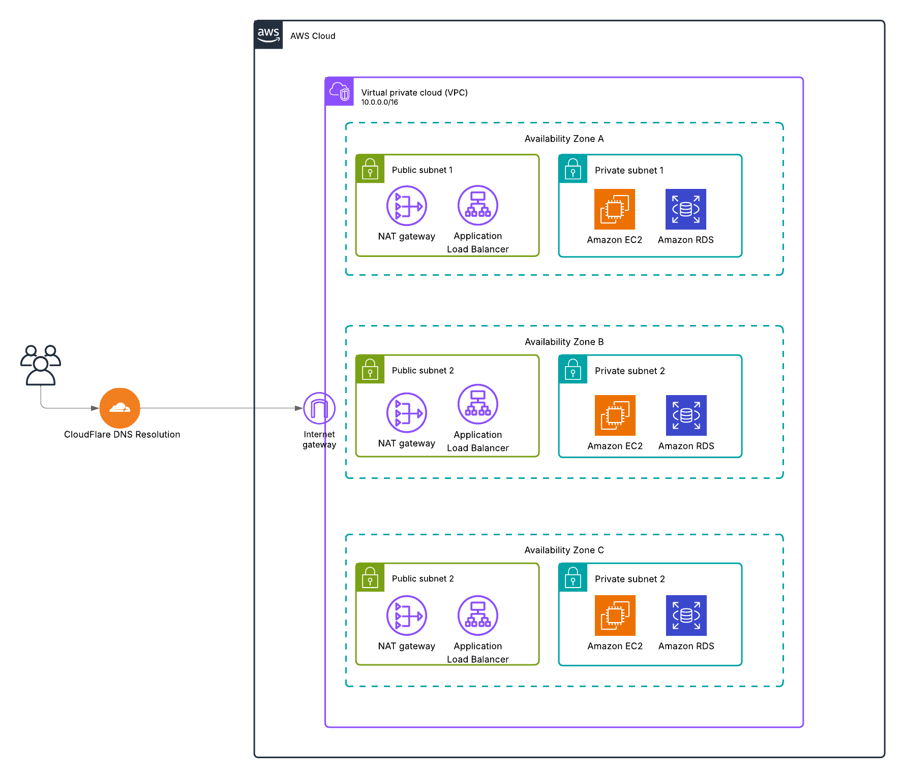

# Basic Infrastructure

This directory contains the basic infrastructure setup for AWS using OpenTofu. The infrastructure includes VPC, networking, and other foundational AWS resources.

## Infrastructure Diagram



## Components

The basic infrastructure is organized into numbered modules, each focusing on a specific aspect of the infrastructure:

1. **State Management** (`001state/`)

   - Backend configuration
   - State file storage setup
   - Provider configuration

2. **VPC Setup** (`002vpc/`)

   - VPC with public and private subnets
   - NAT Gateway
   - Internet Gateway
   - Route tables
   - Network ACLs

3. **Security Groups** (`003securitygroups/`)

   - Security group configurations
   - Ingress and egress rules
   - Security group associations

4. **S3 Buckets** (`004s3/`)

   - S3 bucket configurations
   - Bucket policies
   - Lifecycle rules

5. **ACM Certificates** (`005acm/`)

   - SSL/TLS certificate management
   - Certificate validation
   - DNS validation records

6. **Cloudflare** (`006cloudflare/`)

   - DNS management
   - CDN configurations
   - SSL/TLS settings

7. **Secrets Manager** (`007secrets/`)

   - Secret storage
   - Secret rotation policies
   - Access policies

8. **RDS Databases** (`008rds/`)

   - RDS instance configurations
   - Parameter groups
   - Subnet groups

9. **Application Load Balancer** (`009alb/`)

   - ALB configuration
   - Target groups
   - Listener rules

10. **EC2 Instances** (`010ec2/`)
    - EC2 instance configurations
    - Instance profiles
    - User data scripts

## Usage

Each module can be applied independently or as part of the complete infrastructure. To apply a specific module:

```bash
cd <module-directory>
tofu init
tofu apply
```

## Dependencies

The modules have the following dependencies:

- `002vpc` depends on `001state`
- `003securitygroups` depends on `002vpc`
- `004s3` depends on `001state`
- `005acm` depends on `001state`
- `006cloudflare` depends on `005acm`
- `007secrets` depends on `001state`
- `008rds` depends on `002vpc` and `003securitygroups`
- `009alb` depends on `002vpc` and `003securitygroups`
- `010ec2` depends on `002vpc`, `003securitygroups`, and `007secrets`

## Variables

Each module has its own variables file (`variables.tf`) that can be customized according to your needs. Common variables include:

- `environment`: The deployment environment (e.g., dev, staging, prod)
- `region`: The AWS region to deploy to
- `project`: The project name
- `tags`: Common tags to apply to all resources

## Outputs

Each module provides relevant outputs that can be used by other modules or for reference. Check the `outputs.tf` file in each module for details.
